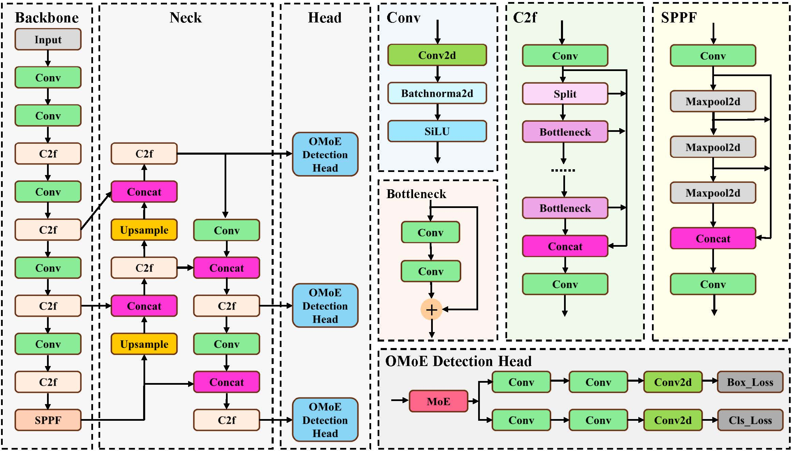
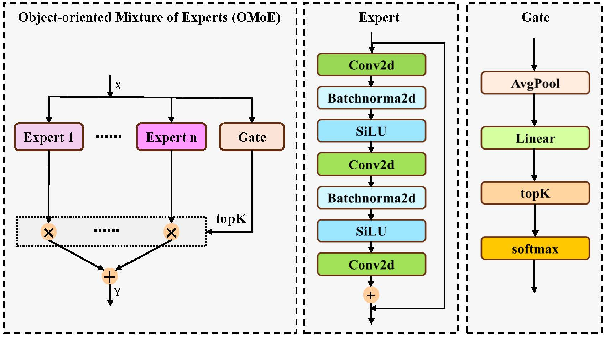

## 
Toward Lightweight Fine-Tuning of YOLO via Guided Optimization for Cross-Domain Remote Sensing Object Detection

### Introduction
We introduces the RMoE-YOLO framework, optimized for low-resource environments and equipped with robust cross-domain capabilities. Specifically, we propose an object-oriented mixture-of-experts (OMoE) for the YOLO architecture. The OMoE encourages the model to focus on learning comprehensive, object-oriented representations, thereby enhancing its representational abilities and reducing its reliance on memorizing intra-segmental features. Furthermore, in our paper, we incorporated optimization constraints within the OMoE to prioritize significant objects and minimize distractions from irrelevant objects. 

### Overview

  
  
 Fig 1. Overview of the proposed RMoE-YOLO framework. RMoE-YOLO extends the YOLOv8n architecture by integrating the OMoE module into the detection head, enabling dynamic feature recalibration and enhancing object-oriented representation learning. 

  
  
 Fig 2. Architecture of our proposed OMoE module. The OMoE integrates a gating network with multiple expert subnetworks, each implemented as a three-layer convolutional block. The gating mechanism dynamically assigns weights and aggregates the outputs of the expert networks, generating optimized feature representations for subsequent detection tasks. 

### Installation
We use "conda create --name RMoE_YOLO python=3.8" to create a environment and install the dependencies in requriements.txt. 

### Datasets
The datasets encompass samples and their subdatasets for both training and test.

- **NWPU-VHR-10** Link：https://pan.baidu.com/s/1kr04SJ4E6P1aL6X0tbQ35w Code：xv4j 

 - **RSOD** Link：https://pan.baidu.com/s/1lw5bHB02PRm3NAwpgJSNDg Code: x58u 

 - **SIMD** Link: https://pan.baidu.com/s/1_fWqcJld3NL-sF38EwXU-Q Code: v8ge

Download the datasets to your disk, and edit the paths in `./ultralytics/cfg/datasets/datasetname.yaml`.

### Training and Test
To train and test the model, simply run train.py and test.py respectively. The program was developed and run in a PyCharm environment on a computer with the Windows 10 operating system.

### Evalutaion Result

  Table 1.  Evaluation results on the NWPU-VHR-10, RSOD and SIMD datasets. 
  
| dataset      | mAP50        | P(M)        | FPS               | GFOPs           | GPU          |
|:------------:|:------------:|:-----------:|:-----------------:|:---------------:|:------------:|
| NWPU-VHR-10  | 95.9         | 8.6         | 4.5               | 49.1            | RTX1080Ti    | 
| RSOD         | 95.7         | 8.6         | 4.5               | 49.1            | RTX1080Ti    | 
| SIMD         | 84.0         | 8.6         | 13.9              | 49.1            | RTX1080Ti    |
  

# Files
**Note**: This is the txt files for evaluation. We continuously optimize our codes, which results in the difference in detection performance. However, the codes still remain consistent with the methods proposed in this paper.

